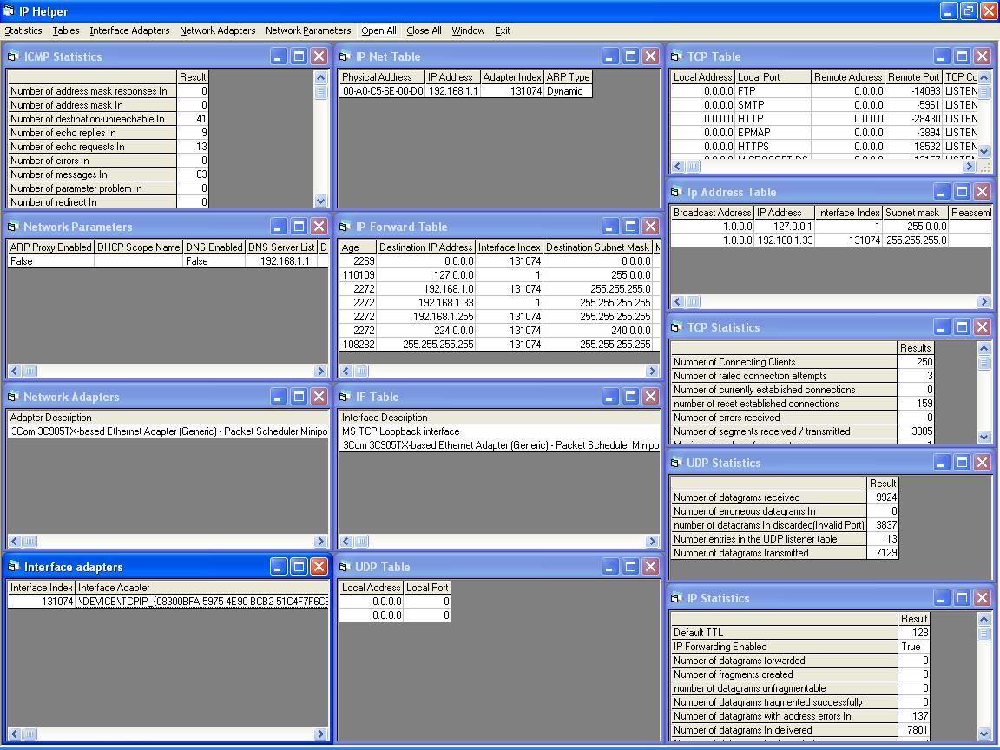



## IP\+DHCP Management

### Description

Gets all IP iformation, add delete ip forward routes, Release and renew DHCP IP address on an adapter, Kill currently connected sockets.
 
### More Info
 

             |
---                |---
**Submitted On**   |2004-03-11 17:34:00
**By**             |[Brian Yule](https://github.com/Planet-Source-Code/PSCIndex/blob/master/ByAuthor/brian-yule.md)
**Level**          |Advanced
**User Rating**    |5.0 (75 globes from 15 users)
**Compatibility**  |VB 4\.0 \(32\-bit\), VB 5\.0, VB 6\.0
**Category**       |[Complete Applications](https://github.com/Planet-Source-Code/PSCIndex/blob/master/ByCategory/complete-applications__1-27.md)
**World**          |[Visual Basic](https://github.com/Planet-Source-Code/PSCIndex/blob/master/ByWorld/visual-basic.md)
**Archive File**   |[IP\+DHCP\_Ma1719123112004\.zip](https://github.com/Planet-Source-Code/brian-yule-ip-dhcp-management__1-52316/archive/master.zip)

